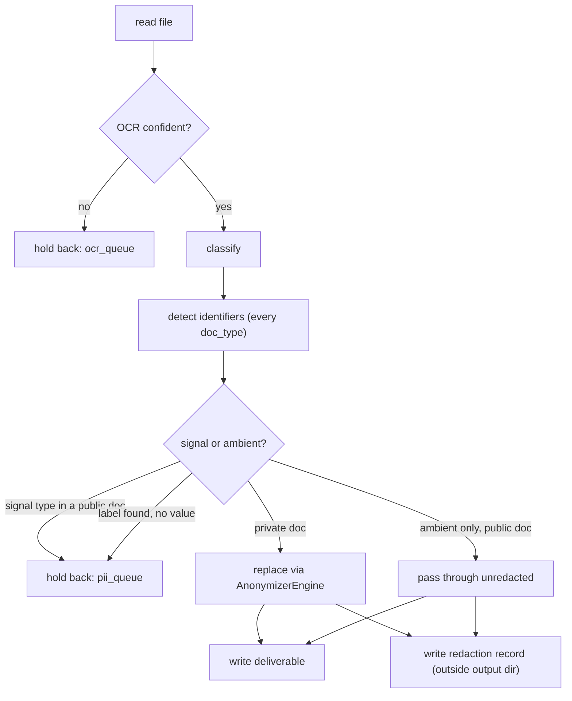

# Medical Record Scrubber Hardening - Plan

## Goal Capsule

**Objective.** Make the local scrub trustworthy enough that text leaving this machine for a commercial LLM carries no patient identifiers, and that the claim "we scrub your data before it leaves our office" is literally true.

**Authority hierarchy.** Requirements (R-IDs) govern behavior. Key Technical Decisions (KTD-IDs) govern mechanism within those requirements. Implementation Units override neither.

**Execution profile.** Test-first. Every unit lands a failing test that reproduces the defect before the fix. The repository's existing convention is TDD and the defects in this plan were all found by measurement, not by reading — a fix without a reproducing test has not been shown to work.

**Stop conditions.** Stop and surface rather than guessing when: a change would make the scrubber emit a document it previously held back; a test in `tests/test_pii.py` must be weakened rather than kept green; a unit's redaction recall drops on any identifier category; or a fixture would be derived from a real client document.

**Tail ownership.** Units land as individual commits on a feature branch. No deployment step exists — this is a local CLI tool.

---

## Product Contract

### Summary

Repair the local PII scrubber so it cannot silently pass a medical record through unscrubbed, cannot silently destroy document text, and covers the healthcare identifiers it currently ignores. Replace the human-approval workflow with an automatic written record of every redaction, held outside the directory that gets uploaded.

### Problem Frame

The tool was built to turn legal documents into training data. It is now being used for a different job: scrubbing client medical records before they are sent to a commercial AI vendor for analysis. The vendor relationship is already authorized under the owner's own professional-responsibility review; this scrub is a deliberate extra layer, and the basis for a specific statement made to clients.

Measurement against a realistic discharge summary found the scrub does not currently support that statement. Four defects, in descending severity:

A single innocuous line — a `©` footer, the words "Bar Association", an ISSN on a patient handout — classifies a medical record as `published` at 100% confidence, and `published` documents never reach the scrubber at all. The record is written out with name, medical record number, Social Security number, date of birth and address intact. Copyright footers are near-universal on medical forms, so this is a routine outcome, not an edge case.

Of sixteen HIPAA Safe Harbor identifier categories tested — the eighteen at 45 CFR §164.514(b)(2) less full-face photographs and biometric identifiers, neither of which can appear in extracted text — eleven survived redaction, including the street address and ZIP code while the city was replaced. The detector is configured for twelve entity types, of which exactly one is healthcare-specific: `MEDICAL_LICENSE` is presidio's DEA certificate recognizer, already enabled and already checksum-validated. Verified on the installed engine — it detects `AB1234563` as `MEDICAL_LICENSE` at 1.00 under the default registry. Where DEA numbers were among the survivors, the cause is threshold or context, not an absent recognizer.

Replacement silently destroys content. spaCy labelled a URL, a line break, and the following line's first word as one person's name at 0.85 confidence; the replacement deleted all of it, and the surrounding text gives no sign a line is missing. A related latent defect leaves fragments of identifiers behind when two detections overlap.

Files inside the output directory carry identifiers that the scrub never examines. The provenance manifest records each document's real filename and full source path, so a client folder name reaches the deliverable directory untouched. The existing adversarial review writes residual identifier values into that same directory and into the HTML report.

**What "leaves the office" actually covers.** The scrub is not the only egress point, and the plan says so plainly rather than letting the client-facing sentence be read as covering more than it does. `re_id_risk.py` — the existing adversarial review — streams up to 24,000 characters of each *already-scrubbed* record to Anthropic (`client.messages.stream`, three 8,000-character segments). Every quasi-identifier it reports is therefore, by construction, one that has already left. `second_pass.py` makes no network call at all, so its patch hardens whatever consumes the records next and can never protect the call that discovered the problem. This is consistent with the vendor authorization above rather than contrary to it — but it means the scrub reduces what the vendor sees, and does not reduce it to nothing.

### Requirements

**Scrub correctness**

- R1. No document reaches an output file without passing through identifier detection, regardless of how it was classified.
- R2. Replacement never removes, reorders, or alters text outside a detected identifier's span.
- R3. Replacement never leaves a fragment of a detected identifier in the output.
- R4. A detected identifier's replacement is type-correct: a year is not replaced by a full date, a URL is not replaced by a person's name, an age is not treated as a date.

**Identifier coverage**

- R5. The scrubber detects medical record numbers, health plan beneficiary and member numbers, and account numbers, using the labels that introduce them in medical text.
- R6. The scrubber detects NPI, DEA, and Medicare Beneficiary Identifier values, rejecting values that fail their published structural checks.
- R7. The scrubber detects device serial numbers, vehicle and licence plate identifiers, web URLs, and street addresses including ZIP codes.
- R8. Ages over 89 are generalised rather than preserved, and are not treated as dates.

**Trust and evidence**

- R9. Every redaction is recorded in a durable evidence record carrying the identifier type, its location, a count, and the document's anonymous id — and no original value. This is the artifact behind the client-facing claim, which needs types, counts and locations and never needed the values.
- R18. Original identifier values are captured only in a separate verification record, which exists so a batch's scrub can be checked by a human, and is deleted once that batch is accepted. No identifier value outlives the review of the batch it came from.
- R10. No original identifier value, and no raw excerpt of document text, is written anywhere inside the output directory or embedded in the generated report. This binds every writer that targets that directory, including the existing adversarial review.
- R11. A document the scrubber cannot clean confidently is held back rather than emitted, and the run reports how many were held back and why.
- R12. Scrub quality is measured per identifier category against a fixture corpus with known contents, and the no-leak check is evaluated against that corpus's ground truth rather than against the tool's own detections.
- R17. Before the tool is relied on for client work, its per-category results are measured against real medical records held outside the repository — not only against the synthetic corpus. A corpus invented by the same hand that wrote the recognizers can only contain the identifier shapes that hand anticipated.
- R16. No file inside the output directory reveals the source document's identity — not its filename, not its path, not its containing folder. Documents are referenced there only by a stable anonymous id.

**Workflow**

- R13. Running the tool requires no per-document human approval.
- R14. Re-running over an existing output directory replaces that document's prior output rather than appending a duplicate.
- R15. Substituted fake values differ across documents, so the substitution scheme cannot be inferred from a set of outputs.

### Scope Boundaries

**In scope.** The local scrub path: classification gating, detection, replacement, quarantine, the redaction record, everything written into the output directory, and the tests that prove all of it.

**Deferred to follow-up work**

- Jev or any other second-opinion model reviewing already-scrubbed output. Separate work, and it depends on this plan producing output worth auditing.
- Improving OCR. Anything OCR fails to read never reaches the text and therefore never reaches the vendor; it is a completeness problem, not a disclosure one.
- Rare-attribute quasi-identifier detection (rare diagnosis plus narrow geography plus date). Real residual risk, named in Risks below, but it needs a prevalence source and is a different kind of work.
- Migrating the existing adversarial review in `re_id_risk.py` to a newer model. It works and its model id is current. U12 changes *where that tool writes*, which is a storage fix, not a model change — not *what it transmits*, which the Problem Frame records as a vendor egress point in its own right.

**Outside this tool's identity**

- Redacted PDFs for litigation production. This tool emits text for machine analysis and has no document-out path by design.
- Any claim of HIPAA Safe Harbor compliance. See KTD8.

### Outstanding Questions

- Q1 (deferred). What precisely triggers quarantine: a document containing any detection the scrubber could not resolve, or an aggregate density threshold? Default taken in U7: quarantine on a *structural* failure — a recognised label with no resolvable value following it — rather than on the presence of any medium-confidence detection, which will be common in real scanned records and would hold back most of a batch. Tune against the U10 corpus.
- Q2 (deferred). How broad should the label lexicon for medical record and member numbers be? Default taken in U5: ship a documented synonym list, and treat a label-like token followed by a bare digit run as a mandatory record entry even when confidence is too low to redact automatically.
- Q3 (resolved 2026-09-18). **The remote is public** — `github.com/jimdawdy-hub/legal-doc-processor` reports `visibility: PUBLIC`. U10 commits a fixture corpus, so this is the answer that leaves no margin: every fixture is invented from scratch, and nothing derived from a real document may be quoted into a fixture, a test, a commit message or this document. The plan already took the stricter path regardless of the answer; the check confirms it was the necessary one rather than the cautious one. R17's real-record measurement therefore happens entirely outside the repository.

---

## Planning Contract

### Key Technical Decisions

- KTD1. **Delete the hand-rolled replacement; route all replacement through `AnonymizerEngine`.** `pii.py` builds an `AnonymizerEngine` and never calls it, hand-slicing strings instead. The library resolves overlapping spans by trimming at the boundary and clamps its splice buffer against re-consuming text. Measured on the same input: hand-rolled finetune mode produced `Norma Fisher45-6789 end` (identifier fragment left behind), hand-rolled placeholder mode produced `[PERSON]SSN] end` (corrupted), the library produced `<PERSON><US_SSN> end`. The fix removes code rather than adding a guard. Governs R2, R3.
- KTD2. **Pass `ConflictResolutionStrategy.REMOVE_INTERSECTIONS` explicitly.** Both strategies the library ships produce correct output on the measured case, because a second clamp inside the splice buffer catches what the default strategy leaves. The explicit strategy makes the guarantee structural rather than incidental. Only two strategies exist; earlier research claiming a third was wrong.
- KTD3. **Memoise every custom replacement callable by its input string.** The library calls a custom operator's callable twice per entity — first with the literal string `PII` for validation, then with the real value. A naive counter-based replacer produced `NAME4 met NAME2` instead of `NAME1`/`NAME2`. Keying a cache on the input value makes the validation call a harmless throwaway entry and simultaneously delivers the within-document consistency the existing tests require.
- KTD4. **Seed Faker per document, not globally.** `Faker.seed(0)` is fixed at module level, so every document's first person becomes `Norma Fisher` — measured across three different inputs. A fixed substitution scheme is inferable from a handful of outputs, which the de-identification literature treats as an assisted re-identification path. Seed from the document content hash, which keeps runs reproducible while varying across documents. Governs R15.
- KTD5. **Gate the scrubber on output, not on classification.** Detection runs on every document regardless of `doc_type`; classification decides only how a document is treated. Fixing the classifier's normalisation alone would close the measured case but leave the architecture one classifier bug away from the same outcome. Governs R1.
- KTD13. **Split entity types into misclassification signals and ambient types.** Some identifiers never legitimately appear in published case law — SSN, medical record number, DEA, NPI, Medicare identifier, member and account numbers, device serials. Finding one in a document classified `caselaw` or `published` is evidence the classifier was wrong, and triggers quarantine. Others saturate legal text: person, date, location. Measured on a genuine appellate opinion, the detector produced three high-confidence hits, all ambient and all false — `2019`, the Latin phrase `de novo`, and the fragment `R. Civ` from a rule citation. Without this split, KTD5's unconditional detection either quarantines every real opinion or substitutes fake names over judges, parties and citations, destroying the corpus the tool was built to produce. Ambient hits in a public-classified document are recorded under R9 and never redacted or quarantined. Governs R1, R11.

  The premise was checked rather than assumed — the legal-corpus path is confirmed still in use (session-settled: user-directed — chosen over collapsing the pipeline to unconditional redaction, which would be simpler and would make a misclassified medical record structurally impossible, but would end the corpus job). This split is therefore load-bearing, not defensive complexity.
- KTD14. **Derive every document-identity key from the file's SHA-256, never from Python's `hash()`.** `pipeline.py` builds `anon_id` from `hash(path.name)`, which is salted per process: three runs produced three different ids for the same filename, and the value is not the eight digits its format string implies. Keying U6's replace-on-rerun logic on it would fail silently and duplicate instead. The content hash is already computed for the provenance manifest. Filename alone is also wrong — two clients' folders can hold the same filename. Governs R14, R16.
- KTD6. **Detect label-anchored identifiers by context, not by format.** Medical record numbers, member IDs and account numbers have no national format and no checksum; there is nothing to pattern-match except the label that introduces them. NPI, DEA and MBI do have published structure, and their validators reject impossible values outright. Governs R5, R6.
- KTD7. **Nothing inside the output directory may identify a source document or quote it.** The output directory is the one thing that leaves the machine, so it is the trust boundary. Three writers currently violate this: the redaction record's predecessor is written there and spliced into the HTML report; the provenance manifest stores the real filename and full source path; and the adversarial review writes residual identifier values there and into the report. The rule covers original values, surrounding-context excerpts, filenames and paths alike — a context window of sixty characters around a flagged SSN routinely contains the patient's name. Governs R10, R16.
- KTD8. **Describe the date handling as interval-preserving, never as Safe Harbor.** Safe Harbor requires dates truncated to year and ages over 89 aggregated. This tool shifts dates by a consistent per-document offset to preserve clinical intervals, which is an Expert Determination technique, not a Safe Harbor one. The behavior is right for the use; the label would be wrong. Governs R8.
- KTD9. **Set the detection floor at 0.30, and add a precision floor as a guardrail.** Missing an identifier is the expensive failure (session-settled: user-directed — chosen over keeping the current 0.50 threshold: over-redaction costs a consistently substituted fake value, under-redaction costs a disclosure). The measured score distribution on the discharge-summary fixture has a clean gap — 31 detections at or above 0.30, nothing at all between 0.05 and 0.30 — so 0.30 is the natural floor and going lower admits only duplicates of values already caught. The change is worth about six detections, including the licence plate that leaked at 0.30; the recognizers in U5 and U11 close the actual gap. Do not mistake the cheap change for the fix. The evidence also qualifies the direction: downstream analysis is stable across moderate-to-high precision de-identification and degrades sharply only once precision collapses, so U10 asserts a minimum per-category precision alongside recall.
- KTD10. **Keep the redaction record; drop the approval step** (session-settled: user-approved — chosen over deleting the reviewing tooling entirely: the record is the evidence behind the client-facing claim). This is new capture, not a rename: today only medium-confidence detections are logged, so the majority of redactions are recorded nowhere but an aggregate count.

  The record is two artifacts, not one. Permanent storage of original values was never part of this decision and the client-facing claim never needed them: a durable evidence record without values (R9) carries the claim, and a transient verification record with them (R18) exists only while a batch is being checked. Keeping both in one permanent file would build a cross-client cleartext index of every identifier ever processed — an artifact whose loss is a breach across the whole client base rather than one matter.
- KTD11. **Hold back documents that cannot be cleaned confidently** (session-settled: user-directed — chosen over emitting them with a flag: a held-back document cannot reach a vendor by accident, and a flag relies on someone reading it). Mirrors the existing low-OCR-confidence queue. Governs R11.
- KTD15. **Keep presidio as the detection base, deliberately rather than by inheritance.** U5 exists to teach a general-purpose PII engine about medical record numbers, member numbers and account numbers — which is the core competency of purpose-built clinical de-identification tooling. That alternative is declined, not unconsidered: presidio is already integrated, actively maintained, gives per-recognizer control over score and validation, and — measured in U11 — already ships validated NPI, MBI and DEA recognizers. The cost is that every clinical identifier is ours to define and maintain, which R17's real-record measurement is the check on. Recorded so the choice is visible and its reversal cost is known, since it rises with every unit built on it.
- KTD12. **Fix the failing provenance tests on the test side.** `ProvenanceManifest.add_file` hashes the source file, which is correct: the hash is the document's identity in the manifest. The tests pass filenames that do not exist. Production behavior is right; the fixture is wrong.

### High-Level Technical Design

The change moves the scrub decision from "what kind of document is this?" to "what did we find in it?", and adds a second axis: which *kind* of thing we found.

Today `detect` sits inside the `private`/`uncertain` branch of `classify`, which is the bypass. Moving it ahead of the branch is the structural fix; the classifier normalisation repair is a second, independent correction; the signal/ambient split is what stops the first two from destroying the case-law corpus.

### Assumptions

- The installed stack is presidio-analyzer and presidio-anonymizer 2.2.362, spaCy 3.8.14, Faker 40.18.0, Python 3.12. Verified, and correcting an earlier misreading that reported spaCy's version as Presidio's.
- Existing output directories may contain records produced by the current version. U6 makes re-runs replace rather than append; it does not retroactively repair an existing mixed directory. Treat a directory produced before this work as disposable — and delete it rather than regenerating over it, since its provenance entries carry real filenames and full source paths. U12 owns the sweep and the Definition of Done gates on it.
- `pii.py` never receives `doc_type`. It returns structural facts only — score, entity type, and whether a recognised label had a resolvable value. `pipeline.py` is the only place that holds both those facts and the classification, and is therefore the only place that adjudicates the public-document quarantine branch. Threading `doc_type` into `pii.py` for convenience would re-create the coupling KTD5 exists to remove.

---

## System-Wide Impact

**Downstream consumers of an unenforced output contract.** `second_pass.py` and `re_id_risk.py` are outside this plan's scope but both read the pipeline's output as an implicit contract: each finetune record's `text` field and its `metadata.{source, doc_type, review_flags, token_count}`. No unit may rename, retype, or change the meaning of these fields. In particular `review_flags` must keep meaning "count of ambiguous detections" — `re_id_risk.py` sorts by it to choose which records get the paid adversarial review first, so redefining it as a total would silently change that prioritisation with no visible error. U8's new total goes in a new field.

**An intervening stage the scrub never sees.** `pipeline.process_file` runs `cleaner.clean()` between reading and scrubbing, and `clean()` deletes whole lines on purpose: it blanks any line containing Thomson Reuters, LexisNexis or Westlaw, drops short lines repeating three or more times as running headers and footers, and collapses runs of blank lines. Any content-preservation assertion written end to end is therefore false — a `©` footer is exactly the line a discharge-summary fixture carries — and would halt the plan on its own Stop conditions over a mis-scoped test rather than a real defect. Every content-preservation check in this plan is scoped to the scrub step: every line entering `strip_pii` is represented in its output. `cleaner.py` is otherwise out of scope; no unit modifies it.

**Read-modify-write concurrency.** `second_pass.py` patches every JSONL output file by reading the whole file, mutating in memory, and rewriting it. U6's idempotent-write design should follow that same whole-file shape rather than inventing a third file-update strategy — and note the existing `_write_lock` guards individual appends, not a read-then-rewrite cycle, so a shared-file rewrite under `--workers` needs the lock to span the whole cycle.

**Two callers of the report generator.** `generate_reports()` is called unconditionally from both `pipeline.py` and `second_pass.py`. U9's removal of the approval UI must leave both call sites producing a report that renders with no server running; neither caller passes a flag distinguishing them.

**Hidden HTML coupling.** `re_id_risk.py` appends its risk section to `summary.html` by locating a sentinel comment, falling back to a raw `</body>` string replace. This coupling is invisible to imports and to any test exercising `reporter.py` alone. Two consequences: U9's template rewrite must preserve the exact anchor text, and any `generate_reports()` run after the splice — which includes every `second_pass.py` run — silently deletes that section. The ordering hazard predates this plan and is out of scope to fix; it is recorded so it is not mistaken for something U9 broke.

---

## Implementation Units

| U-ID | Unit | Primary files | Depends on |
|---|---|---|---|
| U1 | Repair the failing provenance tests | `tests/test_provenance.py` | — |
| U2 | Close the classification bypass | `classifier.py`, `pipeline.py` | U1 |
| U3 | Route replacement through the library | `pii.py` | U1 |
| U4 | Correct over-long spans and chunk boundaries | `pii.py` | U3 |
| U13 | Seed corpus and per-category scorer | `tests/fixtures/`, `tests/test_scrub_quality.py` | U1 |
| U5 | Label-anchored identifier recognizers | `recognizers.py`, `pii.py` | U3, U13 |
| U11 | Checksum-validated identifier recognizers | `pii.py`, `recognizers.py` (only if a gap remains) | U3, U13 |
| U6 | Make re-runs idempotent | `writer.py`, `provenance.py`, `pipeline.py` | U1 |
| U7 | Lower the floor, quarantine, survive errors | `pii.py`, `pipeline.py`, `provenance.py`, `reporter.py` | U2, U5, U11, U6 |
| U8 | Redaction record, held outside the output directory | `writer.py`, `pii.py`, `pipeline.py`, `reporter.py` | U3, U7 |
| U12 | Evict identifiers from the output directory | `provenance.py`, `writer.py`, `re_id_risk.py`, `second_pass.py`, `pipeline.py` | U6, U8 |
| U9 | Retire the approval workflow | `reporter.py`, `review_pii.py`, delete two modules | U8 |
| U10 | Validation corpus and per-category metrics | `tests/fixtures/`, `tests/test_scrub_quality.py` | U13, U4, U5, U11, U7, U12 |

### U1. Repair the failing provenance tests

**Goal.** Restore a green baseline so every later unit's failures are its own.

**Requirements.** Enables R12; no product behavior changes.

**Dependencies.** None.

**Files.** `tests/test_provenance.py`

**Approach.** Four tests fail because the shared helper passes filenames that do not exist on disk while `provenance.py` hashes the file. Per KTD12 the fix is in the fixture: have the helper create a real file under the existing `tmp_dir` fixture and pass that path.

**Execution note.** Confirm all four fail for this single reason before changing anything, then confirm 56 pass after.

**Patterns to follow.** The `tmp_dir` fixture in `tests/conftest.py`.

**Test scenarios.**
- The four currently-failing tests pass without altering their assertions.
- `add_file` still raises when handed a genuinely missing path — the production guarantee is preserved, not removed.

**Verification.** `python3.12 -m pytest tests/ -v` reports 56 passed, 0 failed.

### U2. Close the classification bypass

**Goal.** No document reaches an output file without identifier detection having run on it.

**Requirements.** R1.

**Dependencies.** U1.

**Files.** `classifier.py`, `pipeline.py`, `tests/test_classifier.py`, `tests/test_pipeline.py`

**Approach.** Two independent corrections, per KTD5.

1. In `pipeline.py`, move detection ahead of the `doc_type` branch so it runs for every document. Classification continues to decide *how* a document is treated; it no longer decides *whether* identifiers are looked for.
2. In `classifier.py`, fix the normalisation. Confidence is currently a share of the score that actually fired, so one weak signal alone normalises to 1.0. Normalise against the achievable total for the category instead.

Re-derive the 0.60 cutoff in the same change. The achievable totals differ sharply per category — caselaw 0.90, published 1.10, private 1.90 — so a fixed cutoff does not mean the same thing in each, and the existing cross-category `max()` comparison becomes apples-to-oranges once the denominators diverge. Left unchanged, the cutoff demotes genuine case law: a slip opinion firing only the `OPINION|HELD|AFFIRMED|…` signal scores 0.30/0.90 = 0.33 and falls to `uncertain`, where today it reads 1.00 and classifies `caselaw`. An `uncertain` opinion is scrubbed and produces no RAG output — the corpus destruction KTD13 exists to prevent, and KTD13 cannot help here because it only protects documents already classified public.

Detection running on public-classified documents does not mean redacting them — KTD13 governs what happens next, and U7 implements it. This unit must not start redacting case law.

**Execution note.** Write the reproduction first: a discharge summary with a `©` footer, asserted to be scrubbed. It currently classifies as `published` at 1.00 and is written out untouched.

**Test scenarios.**
- A discharge summary containing name, MRN, SSN, date of birth and address, plus a `©` footer, has all five redacted. Same with "Bar Association" as the only signal, and with an ISSN as the only signal.
- A document matching exactly one 0.20-weight published signal and nothing else reports confidence well below the 0.60 cutoff.
- A genuine law-review article matching several published signals still classifies `published`.
- A genuine multi-page court opinion produces byte-identical output to today — no substitution, no tokens, citations and party names intact.
- Detection runs for all four `doc_type` values — assert on the detection call, not on the output.
- A court opinion whose only caselaw signal is the `OPINION`/`AFFIRMED` keyword still classifies `caselaw`, is not scrubbed, and still receives RAG output.

**Verification.** A medical record carrying any single published or caselaw signal is scrubbed, and a real opinion is unchanged.

### U3. Route replacement through the library

**Goal.** Replacement stops corrupting text and stops leaving identifier fragments.

**Requirements.** R2, R3, R4, R15.

**Dependencies.** U1.

**Files.** `pii.py`, `tests/test_pii.py`

**Approach.** Per KTD1, delete `_faker_replace`, `_token_replace` and `_deduplicate_overlaps`, and call `AnonymizerEngine.anonymize()` with `conflict_resolution=ConflictResolutionStrategy.REMOVE_INTERSECTIONS` (KTD2).

Build the operator map per entity type: a memoised callable returning a Faker value for the fake-value mode, and the built-in replace operator for placeholder mode. Memoisation is mandatory, not an optimisation — the library calls each callable twice per entity, first with the literal string `PII` (KTD3). The existing date-shift logic moves into a callable keyed on `DATE_TIME`; keep its format-preserving behavior unchanged.

Seed Faker from the document content hash rather than the module-level fixed seed (KTD4).

`REMOVE_INTERSECTIONS` *trims* the losing span rather than dropping it, so a low-confidence span partially overlapping a high-confidence one survives as its non-overlapping remainder. That is a behavior change from the current drop-the-loser semantics and needs its own test.

**Execution note.** The eight existing tests in `tests/test_pii.py` assert the Faker mode, within-document consistency, and date-shift format. They are the contract for this unit — keep them green rather than adjusting them to fit the new implementation.

**Patterns to follow.** `_shift_date` and `_DATE_FORMAT_PATTERNS` in `pii.py` carry over unchanged.

**Test scenarios.**
- Two partially overlapping spans of different types produce output containing no fragment of either original value.
- The same input in placeholder mode produces well-formed tokens, not spliced ones.
- Identical mentions of one name in a document receive the same fake value.
- The same name in two different documents receives *different* fake values.
- A date is shifted, preserves its original format, and preserves the interval to a second date in the same document.
- A year appearing as a model year is not replaced by a full date.
- All eight pre-existing `tests/test_pii.py` tests still pass.

**Verification.** No test is weakened. The overlap reproduction that currently yields `Norma Fisher45-6789 end` yields no digits of the original.

### U4. Correct over-long spans and chunk boundaries

**Goal.** A detection that runs past the end of its line stops destroying the text it runs into, and an identifier split across a chunk boundary stops being missed.

**Requirements.** R2, R4.

**Dependencies.** U3.

**Files.** `pii.py`, `tests/test_pii.py`

**Approach.** Two span-correctness defects in `pii.py`, both about offsets rather than detection.

First, the over-long span. spaCy labelled `https://…/rfenwick48\nPhotograph` as one PERSON at 0.85 and replacement deleted all of it. The library cannot help here — it faithfully replaces whatever span it is given — so the span must be corrected before it reaches the anonymizer.

Clamping at any newline is too blunt: a real name wrapped across a soft line break in PDF-extracted text is a legitimate multi-line span, and truncating it would leak the second line. Constrain by what follows the break instead — clamp when the post-break fragment begins a new field or label rather than continuing a phrase — and keep the rule narrow enough to state in one sentence in a comment.

Enabling URL detection does not solve this on its own: measured, the URL is found at 0.60 while the bogus PERSON still wins at 0.85. Add URL detection anyway under R7, but not as this fix.

Second, the chunk boundary. `_analyze_chunked` splits at a fixed 900,000 characters and re-maps offsets, so an identifier straddling the cut is missed silently. This does not need a hand-rolled fix: `presidio_analyzer.chunkers` is a public package in the pinned 2.2.362 — verified, `__all__` exports `BaseTextChunker`, `TextChunk`, `CharacterBasedTextChunker` and `TextChunkerProvider` — and `BaseTextChunker.predict_with_chunking(text, predict_func)` already performs boundary-aware chunking with overlap, offset re-mapping and cross-chunk deduplication. Replace `_analyze_chunked`'s fixed split with `CharacterBasedTextChunker(chunk_size=…, chunk_overlap=…)`; its defaults are 250/50 and must be set explicitly to the document-scale values this pipeline needs.

**Test scenarios.**
- A URL followed by a newline and a capitalised word does not lose the word. Exercise the clamping function directly against a constructed URL detection rather than through the production `entities=ENTITY_TYPES` call — `URL` does not enter `ENTITY_TYPES` until U5, and U4 must stay independently verifiable.
- A person's name genuinely wrapped across a line break is redacted in full, both lines.
- A span crossing two or more newlines is clamped.
- The exact discharge-summary snippet that destroyed `Photograph` preserves it.
- Clamping never extends a span, only shortens it.
- An identifier straddling a chunk boundary is detected, at the correct offset, and appears once rather than twice.

**Verification.** Round-trip a document through the scrubber and assert the content-preservation invariant — every line entering `strip_pii` is represented in its output.

### U13. Seed corpus and per-category scorer

**Goal.** Make recall and precision measurable from the first recognizer onward, rather than after eleven units have landed.

**Requirements.** R12, in part; completed by U10.

**Dependencies.** U1.

**Files.** `tests/fixtures/`, `tests/test_scrub_quality.py`

**Approach.** Split forward from U10 so the recognizer units can measure themselves as they land. U10 sits at the end of the dependency chain, which means the numbers that decide whether this plan worked — per-category recall and precision — do not exist until everything is built; a recognizer with poor recall would surface after the work rather than during it. The plan already applies the opposite reasoning one unit earlier, where U5 asserts U4's span invariant so a defect surfaces immediately rather than five units later. Recall deserves the same treatment.

Build the smallest corpus that covers every identifier category at known offsets — one document per category is enough here — plus the per-category scorer and the ground-truth manifest format. Correctness of the scoring method belongs to this unit: entity-level rather than token-level, an identifier counted as protected only when every mention was caught, and the search performed over each output file's decoded record text rather than by line-oriented grep.

This is deliberately not the validation corpus. It is the measuring instrument. U10 grows the corpus to full scope, adds the floors, and adds the adversarial cases; both units write the same two paths, so U10 extends this unit's files rather than replacing them.

**Test scenarios.**
- Every identifier category appears in at least one fixture with a recorded offset.
- The scorer reports per-category recall and precision on the current code, whatever those numbers are — this unit establishes the baseline, it does not assert floors.
- With a recognizer deliberately disabled, the affected category's recall drops and the scorer says so — proving the instrument can fail before anything depends on it.
- Fixtures are invented from scratch; the Stop condition on real-client material applies here exactly as it does in U10.

**Verification.** `python3.12 -m pytest tests/test_scrub_quality.py -v` runs and prints a per-category table before U5 begins.

### U5. Label-anchored identifier recognizers

**Goal.** Detect the identifiers that have no format of their own, plus the remaining structured categories.

**Requirements.** R5, R7, R8.

**Dependencies.** U3, U13.

**Files.** `recognizers.py` (new), `pii.py`, `tests/test_recognizers.py`

**Approach.** Per KTD6, medical record number, member/beneficiary number and account number have no format to match — key on the labels that introduce them, with a documented synonym list per Q2. A label-like token followed by a bare digit run that cannot be resolved confidently must still produce a record entry and a quarantine signal; silence is the failure mode this plan exists to remove.

Add device serial, vehicle and licence plate, URL, and address including ZIP. Generalise ages over 89 rather than preserving them, and stop routing ages through date handling — measured, `91-year-old` is currently detected as `DATE_TIME` at 0.85 and date-shifted, which is the wrong treatment (R4, R8, KTD8).

Create `recognizers.py` for recognizer definitions and move the SSN pattern currently registered inline in `pii.py`'s engine setup into it, so `pii.py` keeps engine construction, operators, thresholds and seeding while recognizer definitions live together.

Declarative YAML configuration is available for plain pattern recognizers and is a reasonable fit for this unit's recognizers, none of which need a validation hook.

**Test scenarios.**
- Each label synonym for medical record number, member ID and account number is detected with a realistic adjacent value.
- An unrecognised label followed by a digit run produces a record entry and a quarantine signal rather than passing silently.
- Ages 89 and 90 are handled differently; 90 does not survive as a literal number and is not date-shifted.
- Street address, ZIP, device serial, plate and URL from the discharge-summary fixture are all redacted.
- Every line entering `strip_pii` is still represented in its output — the U4 invariant, asserted here so a new recognizer's span defect surfaces immediately rather than five units later.

**Verification.** The label-anchored categories on the discharge-summary fixture leave zero survivors.

### U11. Checksum-validated identifier recognizers

**Goal.** Detect NPI, DEA and Medicare identifiers, and reject values that cannot be real.

**Requirements.** R6.

**Dependencies.** U3, U13.

**Files.** `recognizers.py`, `pii.py`, `tests/test_recognizers.py`

**Approach.** Do not hand-write these validators. The pinned presidio 2.2.362 already ships all three, tested; the reason they do not fire today is that `pii.py` never asks for their entity types. Verified against the installed library:

- `UsNpiRecognizer` (entity `US_NPI`) — Luhn over the constant `80840` prefix per CMS, plus an `invalidate_result` for degenerate repeats. **Not** in the default registry; must be registered explicitly.
- `UsMbiRecognizer` (entity `US_MBI`) — positional letter/digit rules excluding S, L, O, I, B and Z. **Not** in the default registry; must be registered explicitly.
- `MedicalLicenseRecognizer` (entity `MEDICAL_LICENSE`) — the DEA certificate recognizer, pattern `USA DEA Certificate Number (weak)` at 0.4 with a Luhn `validate_result` that lifts a valid number to 1.00. **Already** in the default registry, and `MEDICAL_LICENSE` is **already** in `ENTITY_TYPES`.

So the work is registration and verification, not construction: `from presidio_analyzer.predefined_recognizers import UsNpiRecognizer, UsMbiRecognizer`, added to the registry in `pii.py`'s `_get_engines()` beside the existing SSN `PatternRecognizer`, with `US_NPI` and `US_MBI` added to `ENTITY_TYPES`. DEA needs no new recognizer at all — if it survived the fixture, the cause is the detection floor or missing context, so U11's DEA scope is to measure it and tune, and to record which it was.

Write `recognizers.py` only for a gap these three leave. If the fixture shows none, the file is not created and the unit is smaller than planned — that is the correct outcome, not a shortfall.

Still split from U5 because these are closed-form and stable while U5's are open-ended and expected to need repeated tuning; bundling them means every lexicon tweak re-tests the validators for no benefit. Note MBI has no checksum — it proves structural plausibility only and will admit a well-formed fake.

**Test scenarios.**
These are acceptance tests against the library's behavior, not unit tests of our own validators.
- A valid NPI is detected; a ten-digit string failing the check digit is not.
- A valid DEA number is detected; one with a wrong check digit is not.
- A well-formed MBI is detected; one containing an excluded letter is not.
- A checksum rejection removes the result rather than lowering its score.
- `US_NPI` and `US_MBI` are absent from the default registry, so the test asserts detection through `pii.py`'s configured engine — not through a directly instantiated recognizer, which would pass even if registration were forgotten.
- Every line entering `strip_pii` is still represented in its output.

**Verification.** All three categories detected on the fixture, with invalid variants rejected in both directions.

### U6. Make re-runs idempotent

**Goal.** Re-running over an existing output directory replaces a document's output instead of duplicating it.

**Requirements.** R14; KTD14.

**Dependencies.** U1.

**Files.** `writer.py`, `provenance.py`, `pipeline.py`, `tests/test_writer.py`, `tests/test_provenance.py`

**Approach.** Finetune records are appended, so every re-run adds a byte-identical duplicate of every previously-processed document; the provenance manifest starts empty each run and replaces the file list wholesale. The quarantine loop in U7 is "fix the document, run it again", so this defect would be exercised immediately and would corrupt manual testing of everything after it.

Key finetune records by the source file's SHA-256 and replace; merge the provenance file list by the same key rather than replacing it. Replace `anon_id`'s derivation from `hash(path.name)` with the same content hash (KTD14) — measured, the current value differs on every invocation and is not the eight digits its format string claims.

Re-running must not silently revert a record that `second_pass.py` has already hardened. Record that a document has received a second pass, and skip regenerating an unchanged source whose record carries that mark.

**Patterns to follow.** Extend `pipeline.py`'s existing `_write_lock` to span the full read-merge-rewrite cycle on the shared `output/finetune/dataset.jsonl` and on `provenance.json`, matching the whole-file shape System-Wide Impact specifies. Today that lock guards only the individual append inside `write_finetune_record`, which is not enough once the write becomes read-then-rewrite.

Do **not** restructure finetune records into per-document files on the `write_rag_chunks` model. That shape is correct for RAG output, which is genuinely one file per document, but `second_pass.py` hardcodes the single `output/finetune/dataset.jsonl` path to locate finetune records — splitting the file would break it silently.

**Test scenarios.**
- Processing the same directory twice yields the same number of finetune records as processing it once.
- A document whose content changed between runs has its record replaced, not duplicated.
- The same document produces the same key in two *separate* CLI invocations, not just twice within one process.
- Two documents in different folders sharing a filename receive different, non-colliding ids throughout provenance, finetune records and both redaction records.
- Provenance after a second run retains entries for documents processed in the first run but absent from the second input.
- A record already patched by `second_pass.py` is not reverted by a re-run over an unchanged source.
- Under `--workers 4`, concurrent writes still produce one record per source document.

**Verification.** Process a fixture directory twice; record count and provenance count are identical, and keys match across invocations.

### U7. Lower the floor, quarantine, survive errors

**Goal.** Redact borderline detections by default, hold back what cannot be cleaned, and never lose a whole batch to one bad file.

**Requirements.** R11; KTD9, KTD11, KTD13.

**Dependencies.** U2, U5, U11, U6.

**Files.** `pii.py`, `pipeline.py`, `provenance.py`, `reporter.py`, `tests/test_pipeline.py`

**Approach.** Set the floor to 0.30 per KTD9.

Note an ordering subtlety in the library: duplicate and containment resolution runs *before* score thresholding, so a high-scoring span can absorb a contained lower-scoring one and then itself be dropped by the threshold, leaving nothing where the weaker detection would have served. Lowering the threshold moves away from that hazard, but it deserves a test.

Add quarantine mirroring the existing low-OCR-confidence queue: copy the source aside, mark the result skipped with a distinct reason, write neither output. Triggers: a recognised label with no resolvable value (Q1's default), or a *misclassification-signal* type found in a public-classified document (KTD13). Ambient types in a public document never trigger it. The adjudication happens in `pipeline.py`, which alone holds both the detection facts and the classification — `pii.py` does not receive `doc_type`.

Wrap per-file processing in both the single-worker and `--workers` branches so an unhandled exception routes that one document to a distinct `processing_error` hold-back instead of aborting the batch. Today an exception propagates out of the loop and the manifest and report are never written at all, so a long unattended run can fail wholesale and leave no record saying so.

Generalise the two hardcoded spots or the new hold-backs will not appear in the run summary: the provenance summary counts only the OCR skip reason, and the report labels that tile "OCR queue (low confidence)". Each reason gets its own counter and label.

**Test scenarios.**
- A document with a recognised label and no resolvable value is quarantined; no deliverable is written for it.
- A document classified `published` containing a high-confidence SSN is quarantined.
- A genuine court opinion whose only high-confidence hits are person, date and location is *not* quarantined and is not redacted.
- A document with several ordinary medium-confidence detections is not quarantined — the common case must still flow.
- A plate at 0.30 is redacted after the floor change.
- A corrupt file that passes the extension check does not abort the batch in either worker mode; the run completes, writes a manifest, and reports that document under `processing_error`.
- Quarantine leaves no partially-written output behind.
- The summary reports OCR, PII and error hold-backs as three separate counts with distinct labels.
- `--dry-run` reports what would be quarantined and writes nothing.

**Verification.** A batch containing one unresolvable document, one corrupt document and one real opinion emits deliverables for the rest, passes the opinion through untouched, and names both hold-backs in the summary.

### U8. Redaction record, held outside the output directory

**Goal.** Produce the written evidence behind the client-facing claim, without creating a new disclosure risk that outlives its purpose.

**Requirements.** R9, R10, R18.

**Dependencies.** U3, U7.

**Files.** `writer.py`, `pii.py`, `pipeline.py`, `reporter.py`, `tests/test_audit_record.py`

**Approach.** Per KTD10 this is new capture: today's log covers only medium-confidence detections, so most redactions are recorded nowhere but a count. Capture every redaction — but into **two** artifacts with different lifetimes, not one.

The **evidence record** (R9) is durable. It carries identifier type, location, count and the document's anonymous id, and no original value. It is what backs the client-facing claim, and it can be kept indefinitely because losing it discloses nothing.

The **verification record** (R18) carries the original values, and exists only so a human can check that a batch was scrubbed correctly. It is deleted when that batch is accepted. Without that deletion the tool accumulates a cross-client cleartext index of every identifier it has ever seen — permanent, growing with every run and with U7's lowered floor, and a single point whose compromise is a breach across the whole client base rather than one matter. File permissions do not mitigate that; a lifetime does.

Per KTD7 the verification record is the most sensitive artifact the tool produces while it exists. Its storage contract is part of this unit, not left to the implementer, and applies to both records except where noted:

- A single stable location outside the output directory.
- Directory `0700` and files `0600`, set explicitly at creation rather than inherited from the process umask.
- Written atomically — temp file then rename — so a crash cannot leave a truncated record that reads as complete.
- Keyed by the source file's SHA-256 per KTD14, not a slugified filename, which collides across folders.
- Replaced on re-run under the same rule as the deliverable (U6).
- The verification record carries its batch id and an accepted marker. An explicit accept action deletes it; nothing accepts a batch implicitly, and a batch left unaccepted is reported on the next run rather than aged out silently.
- `reporter.py::generate_reports()` reads identifier type, count and location from the **evidence** record, never from the verification record. It currently loads its entire flag set from `output_dir/review/review_log.jsonl` — the record's predecessor — and only writes `review_log.csv` when that list is non-empty, so relocating the record without rewiring the reader makes the summary silently report zero identifiers instead of failing. It must emit no original value and no context excerpt into `summary.html` or `review/review_log.csv`.

The file write itself belongs in `writer.py` beside `write_rag_chunks` and `write_finetune_record`, not in `pii.py`. Per-document files follow the RAG writer's shape and need no lock under `--workers`.

Preserve the `review_flags` field name and its present meaning — the count of *ambiguous* detections. `re_id_risk.py` sorts by it to prioritise the most uncertain documents; redefining it as a total would invert that ordering. The new total goes in a new field.

**Test scenarios.**
- Every redaction appears in the evidence record, high-confidence ones included.
- The evidence record contains no original identifier value — asserted against the fixture's ground-truth list, not against the tool's own detections.
- Both records are written outside the output directory, with `0600`/`0700` regardless of the process umask.
- Accepting a batch deletes its verification record and leaves the evidence record intact and still readable.
- An unaccepted batch's verification record survives and is named in the next run's summary; nothing deletes it on a timer.
- A kill mid-write never leaves a file that parses as complete but is truncated, and never leaves one document's record under another's key.
- Two documents whose slugified filenames would collide each produce their own uncorrupted record under `--workers 4`.
- The generated report and every file in the output directory carry identifier types, counts and locations — and no original value and no surrounding-context excerpt.
- `review_flags` still counts ambiguous detections only; the new total is a separate field.
- A quarantined document still produces a record of what was found in it.
- After the record moves, `generate_reports()` still lists identifier types and counts — asserted against a fixture with known non-zero identifiers, so an empty-flag regression fails rather than passing quietly.

**Verification.** Scrub a fixture and grep the entire output directory for every identifier in it: zero hits. Grep the record location: all present.

### U12. Evict identifiers from the output directory

**Goal.** Close the disclosure paths that bypass the text scrub entirely.

**Requirements.** R10, R16.

**Dependencies.** U6, U8.

**Files.** `provenance.py`, `writer.py`, `re_id_risk.py`, `second_pass.py`, `pipeline.py`, `tests/test_provenance.py`, `tests/test_writer.py`

**Approach.** Three writers put identifiers into the output directory without ever passing through the scrubber, so no text-based check would ever catch them.

`provenance.py` records three source-identifying fields, not two: `original_filename` and the full resolved `source_path` per file, and — easily missed — `save()` also writes `manifest['source_dir']`, the resolved *input directory*, at manifest level. A client folder named for the patient reaches the deliverable directory verbatim through any of the three. Store only the anonymous id per KTD14, and move the id-to-filename mapping and the input directory (if traceability still wants them) into U8's **evidence** record. It has to be the durable one: an evidence entry that cannot be tied back to a document stops answering the question the record exists to answer, and that must survive batch acceptance. A filename is source-identifying but it is not an identifier value, and the evidence record lives outside the output directory, so R10 and R16 are unaffected.

`writer.py::write_rag_chunks` is the leak with no scrub in front of it at all: it names its output `output/rag/{slug}.jsonl` where the slug is the slugified *source filename*, sets each record's `id` to `{slug}_chunk_NNN`, and stores the real filename in every record's `metadata.source`. The patient's name can therefore be the filename on disk, inside the id, and inside every chunk's metadata, none of which the text scrub ever touches. Key all three on KTD14's content-hash id. This also removes a silent collision: two same-named files in different client folders currently overwrite each other's RAG output, the same hazard U6 tests for the other artifacts.

`re_id_risk.py` writes `re_id_risk_report.json` into the output directory holding, for every quasi-identifier the adversarial pass finds, the exact surviving text — by construction, values just proved to be identifying — and splices truncated copies of the same values into `summary.html`. Move the report outside the output directory alongside U8's **verification** record — it holds surviving identifier values, so it shares their lifetime and is deleted when the batch is accepted — and reduce the HTML section to counts and risk levels. This is a storage change, not the model migration deferred in Scope Boundaries.

Moving that report breaks two readers that must move with it, or the unit breaks its own feature: `second_pass.py::run_second_pass` hardcodes `report_path = output_dir / 're_id_risk_report.json'` and exits 1 with "No re_id_risk_report.json found" when it is absent, and `re_id_risk.py --apply` chains straight into that same function. Both must resolve the report from the new location.

**Test scenarios.**
- `provenance.json` contains no substring of any input filename, path component, or folder name — asserted over `original_filename`, `source_path` and manifest-level `source_dir`.
- No RAG output filename, record `id`, or `metadata.source` contains any substring of an input filename.
- Two documents in different folders sharing a filename produce two distinct RAG files, neither overwriting the other.
- `re_id_risk.py --apply` completes end to end after the move, and `second_pass.run_second_pass` locates the report in its new location.
- The id-to-filename mapping is recoverable from the record outside the output directory.
- A directory produced by the pre-change version is detected by its provenance shape and reported for deletion rather than silently regenerated over.
- Grep the output directory for every value in the adversarial report: zero hits.
- The HTML risk section renders with counts and risk levels and no quoted text.
- A document is still traceable end to end by a human holding both artifacts.

Finally, sweep what already exists. Output directories produced by the current version hold provenance entries carrying real filenames and full source paths — the exact R16 leak this unit closes for new runs. Assumptions call those directories disposable, but disposable is not deleted: absent an explicit sweep the plan can be wholly complete while the leak still sits on disk. This unit owns locating and deleting them, not merely regenerating over them.

**Verification.** After a full run including the adversarial pass, no file inside the output directory contains an identifier, a filename, or a path — and no output directory predating this work remains on disk.

### U9. Retire the approval workflow

**Goal.** Remove the per-document approval step and the code that exists only to serve it.

**Requirements.** R13.

**Dependencies.** U8.

**Files.** `reporter.py`, `review_pii.py`, delete `review_server.py` and `apply_decisions.py`, `tests/test_reporter.py`

**Approach.** Delete `review_server.py` (standalone, nothing imports it) and `apply_decisions.py` (imported only by `review_server.py`). This also retires a second, divergent copy of the replacement logic that `apply_decisions.py` keeps — it reaches into `pii.py`'s private functions and reimplements the confidence split, so deleting it removes a path U3's fix would otherwise have to be applied to twice.

`reporter.py` cannot be deleted: `pipeline.py` and `second_pass.py` both call `generate_reports` unconditionally. Strip only the approval controls — the decision buttons, the batch-action tables that drive them, the `fetch` calls to the now-absent server, and the CSV `decision` column hardcoded to `approve`. Keep the per-file statistics and the identifier listing, minus values and context excerpts per KTD7.

Preserve the exact anchor text `re_id_risk.py` searches for when splicing its section into the HTML; the template rewrite would otherwise break it silently.

`review_pii.py` is already a read-only viewer. Keep it, point it at U8's **verification** record — it exists to check values, so it is the one consumer that legitimately needs them, and it is also where the accept action belongs — and refuse or warn when its CSV export targets a path inside the output directory — it writes original values, and the habit of dropping an export next to the deliverable is exactly how they would end up there.

**Test scenarios.**
- `generate_reports` still runs from both `pipeline.py` and `second_pass.py` after the removal.
- The generated report contains no fetch call and no decision controls.
- The exported CSV has no `decision` column.
- The anchor `re_id_risk.py` splices against survives the template rewrite.
- `review_pii.py` reads and summarises the new record, and refuses a CSV target inside the output directory.
- No module imports either deleted file.

**Verification.** Full run end to end with no approval step; the report opens and renders without a server running.

### U10. Validation corpus and per-category metrics

**Goal.** Prove the scrubber works against known contents, rather than inferring it from a green suite.

**Requirements.** R12, R17; KTD9's precision guardrail.

**Dependencies.** U13, U4, U5, U11, U7, U12.

**Files.** `tests/fixtures/`, `tests/test_scrub_quality.py`

**Approach.** Grow U13's seed corpus into a full synthetic corpus of medical-record-shaped documents with every identifier category injected at known offsets, and add the floors U13 deliberately left out. Synthetic rather than a public annotated corpus: the research-standard sets require a data use agreement and their access is currently unreliable, and a fixture with known contents is a stronger fit for a regression suite.

Every fixture is invented from scratch. Nothing in `tests/` may be copied or adapted from a real client document, and the same applies to any snippet quoted in a test, a commit message, or this repository's documentation. Genuinely real reproduction material stays in the already-gitignored `local-notes/`. Resolve Q3 before this unit lands.

Score per category, entity-level rather than token-level — an identifier counts as protected only if every mention was caught. Assert a recall floor per category and a minimum precision floor per KTD9.

The no-leak check evaluates against *this corpus's ground-truth list*, never against the tool's own detections. Checking the tool's output against its own findings is circular: if a recognizer silently stops firing for a whole category, that check still reports zero leaks. This is the difference between the suite proving something and the suite agreeing with itself.

That removes one circularity and leaves a second one this unit cannot close by itself. A corpus invented from scratch contains the identifier shapes its author anticipated, and the Risks section records that the literature's hardest category is institution-specific formats — local abbreviations, internal codes, facility-specific layouts — which is precisely what nobody can invent from memory. A green suite here therefore proves the recognizers work on identifiers we already knew how to describe. R17's measurement against real records is the external check, and it is a gate on using the tool, not on finishing this unit: run the finished scrubber over a real batch held in the gitignored `local-notes/`, hand-check a sample of every category, and record the per-category result outside the repository. Nothing from that batch may be quoted into a fixture, a test, a commit message or this document.

Search by concatenating each output file's decoded record text, not by raw line-oriented grep. Records are one per line, so an identifier straddling a chunk split has half on each line and matches neither.

**Test scenarios.**
- Per-category recall and precision meet their floors across the corpus.
- Zero survivors on the high-harm categories — SSN, MRN, account and member number — regardless of aggregate score.
- A checksum-invalid NPI and DEA are rejected and a valid one detected, both directions asserted.
- With a recognizer deliberately disabled so a whole category never fires, the check *fails* — proving it is bound to ground truth and not to the tool's own output.
- An identifier straddling the output chunk boundary is caught by both detection and the no-leak check.
- An identifier straddling the 900,000-character analysis boundary is detected. Manual chunking with offset re-mapping is the library maintainers' recommended approach, but a straddling identifier is a silent false negative, not an error.
- Every line entering `strip_pii` is represented in its output, corpus-wide.

**Verification.** `python3.12 -m pytest tests/test_scrub_quality.py -v` reports per-category numbers and passes its floors.

---

## Verification Contract

| Gate | Command | Applies to |
|---|---|---|
| Full suite | `python3.12 -m pytest tests/ -v` | Every unit |
| Scrub quality | `python3.12 -m pytest tests/test_scrub_quality.py -v` | U4, U5, U11, U7, U10 |
| Sixteen-identifier check | Scrub the discharge-summary fixture; assert 0 of 16 survive | U5, U11, U7 |
| No-leak check | Search every file in the output directory for every identifier in U10's ground-truth list; assert zero hits | U8, U10, U12 |
| Source-identity check | Assert no file in the output directory contains an input filename, path component or folder name | U12 |
| Case-law fidelity check | Assert a genuine opinion passes through byte-identical and unquarantined | U2, U7 |
| Content-preservation check | Assert every line entering `strip_pii` (post-`clean()`) is represented in its output | U4, U5, U11, U10 |
| End-to-end | `python3.12 process.py --input tests/fixtures/corpus --output <tmp>` completes with no approval step | U9 |
| Per-category baseline | `python3.12 -m pytest tests/test_scrub_quality.py -v` prints a per-category table, floors not yet asserted | U13 |
| Record separation | Assert the evidence record holds no original value, and that accepting a batch deletes its verification record | U8 |
| Real-record measurement | Outside the suite: scrub a real batch from `local-notes/`, hand-check every category, record results outside the repository | R17 gate, before client use |

Run from the repository root — tests import modules top-level with no package-relative paths.

---

## Definition of Done

**Global.**
- All tests pass, including the eight pre-existing `tests/test_pii.py` tests, unweakened.
- A medical record carrying any single published or caselaw signal is scrubbed; a genuine opinion is not.
- Zero of the sixteen tested identifier categories survive the discharge-summary fixture.
- No identifier value, context excerpt, filename or source path appears anywhere in the output directory — verified against U10's ground truth, not against the tool's own detections.
- Every line entering `strip_pii` is represented in its output. The invariant is scoped to the scrub step, not end to end: `cleaner.py` deliberately removes lines before it.
- Both records live outside the output directory with `0600`/`0700` permissions and survive an interrupted write. The evidence record carries no original value; the verification record carries them and is deleted when its batch is accepted.
- No output directory produced before this work remains on disk. Regenerating over one does not count — the old provenance entries carry real filenames and full source paths.
- A full run needs no human approval; OCR, PII and error hold-backs are reported separately by count and by name.
- One corrupt document does not cost the batch its manifest or its report.
- Dead-end and experimental code from abandoned approaches is removed, not left in the diff.

**Before the tool is used on client work.** Code-complete is not the same as validated, and this gate is the difference. Per R17, run the finished scrubber over a real batch held in the gitignored `local-notes/`, hand-check a sample of every identifier category, and record the per-category result outside the repository. A green suite proves the recognizers work on identifiers we already knew how to describe; only real records test the category the literature says is hardest. Nothing from that batch is quoted into a fixture, a test, a commit message or this document.

**Per unit.** Each unit's Verification row passes, and each landed as its own commit with its reproducing test written first.

---

## Risks & Dependencies

- **The verification record is a new concentration of cleartext identifiers.** Its primary mitigation is its lifetime, not its file mode: R18 deletes it when a batch is accepted, so it never becomes the permanent cross-client index that a single permanent record would have been. The residual risks are the ones neither a lifetime nor a file mode fixes — an editor leaving a swap or backup file beside it, a sync client picking up its directory, terminal scrollback from the viewer, and a batch that is never accepted and so is never deleted. Mitigations: use the read-only viewer rather than a general editor, place the record where backup tooling includes or excludes it deliberately rather than by accident, and treat U8's unaccepted-batch report as the thing that stops an abandoned batch from quietly becoming permanent.
- **Residual quasi-identifier risk.** Removing all eighteen categories does not make a clinical narrative anonymous. A rare diagnosis plus narrow geography plus a date window can still identify a person, which is what Safe Harbor's own actual-knowledge caveat covers. Deferred above; the existing adversarial review is the current partial mitigation.
- **Fixture provenance is irreversible if wrong.** U10 commits a corpus to a repository with a *public* GitHub remote (Q3). A fixture derived from a real record would be the exact breach this plan exists to prevent, self-inflicted. Q3 and U10's approach address it; the risk is that the discipline lapses later, when someone reaches for a real document because it reproduces a bug more conveniently.
- **Chunk-boundary false negatives — now owned, not accepted.** Text over 900,000 characters is split and offsets re-mapped; an identifier straddling the cut was missed silently. An earlier draft accepted this on the belief that the library's chunker was internal to its transformer recognizers; that was wrong. `presidio_analyzer.chunkers` is a public package in the pinned 2.2.362 with its own `__all__`, so U4 now replaces the hand-rolled split and U10's straddling test has an owner. Residual risk is the overlap width: an identifier longer than the configured `chunk_overlap` can still straddle, so the overlap must exceed the longest identifier format in scope.
- **Detection ceiling.** The literature consistently reports that automated systems under-detect institution-specific identifiers — local abbreviations, internal codes, facility-specific formats — more than universally formatted ones. That is precisely the category U5 adds. Expect the label lexicon to need extension against real documents; treat U10's corpus as a living fixture. This is also the category a synthetic corpus structurally cannot test — nobody invents a local abbreviation they have never seen — which is why R17 measures against real records before the tool is relied on, and why that gate sits outside the test suite rather than inside it.
- **No test coverage exists today** for `reporter.py`, `review_server.py`, `apply_decisions.py` or `review_pii.py`. U9 modifies and deletes in that area with no regression net, which is why its tests are written first.
- **Pre-existing, out of scope:** the OCR path writes a temporary copy of the original PDF with `delete=False` and never removes it, leaving an untracked pre-scrub copy in the system temp directory. Not a new exposure, but it survives a "delete the project folders" cleanup.

---

## Sources / Research

- Overlap, operator and threshold behavior verified by reading the installed `presidio_analyzer` and `presidio_anonymizer` 2.2.362 source, and confirmed by direct execution: the double-call gotcha (KTD3) and the two available conflict strategies (KTD2) were measured, not inferred.
- The score distribution behind KTD9's 0.30 floor, the case-law false positives behind KTD13, the unstable `anon_id` behind KTD14, and the fixed-seed substitution behind KTD4 were all measured against this repository, not taken from documentation.
- Chunking guidance: presidio issues 935 and 957, where the maintainers confirm re-alignment is not built in and recommend chunking at sentence boundaries over fixed character counts.
- NPI check digit: CMS, *Requirements for National Provider Identifier (NPI) and NPI Check Digit*. Validated locally against the published example plus two other real-format values. MBI format: CMS, *Understanding the MBI*, validated against its published example.
- Safe Harbor categories and the date rule: 45 CFR 164.514(b)(2), and HHS de-identification guidance. The date-shifting distinction in KTD8 follows from 164.514(b)(1).
- Over-redaction evidence: *The Impact of De-identification on Downstream Named Entity Recognition in Clinical Text* (Louhi 2020) — downstream performance holds across moderate-to-high precision and collapses only at low precision, which is the basis for KTD9's precision guardrail.
- Surrogate predictability: the de-identification literature treats an inferable substitution scheme as an assisted re-identification path, which with the measured fixed Faker seed is the basis for KTD4.
- Entity-level rather than token-level scoring, and the synthetic-corpus strategy: Text Anonymization Benchmark methodology, and the access constraints on i2b2/n2c2.
